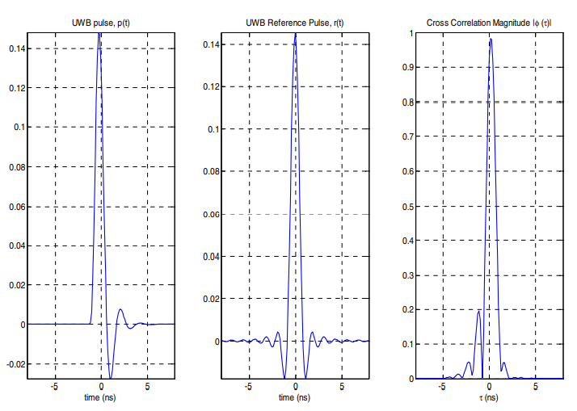

5. UWB基带相关基础
==================

5.1 UWB信号
-----------

通常，UWB信号被定义为具有大于20%相对带宽或至少500MHz绝对带宽的信号。
关于超宽带的两种定义如下（美国FCC规定）:

 - 对于中心频率大于2.5GHz，绝对带宽需要大于500MHz。
 - 对于中心频率小于2.5GHz，频宽比（fractional bandwidth）大于0.2。

.. math::

    B_{frac} = \frac{2(f_H-f_L)}{f_H+f_L} > 0.2

UWB信号的主要特征是其比传统信号占据更宽的频带。相应的其持续时间非常短，通常为ns量级。

5.1.1 高斯脉冲
~~~~~~~~~~~~~~

.. math::

    \omega(t) = A(1-\frac{4\pi t^2}{\zeta^2})e^{-2\pi t^2/\zeta^2}

:math:`\zeta` 为脉冲主瓣宽度，周期为N。

.. figure:: fig/fig_1_gaussian_pulse.png
    :alt: 高斯脉冲波形

    高斯脉冲波形

图中所示脉冲宽度为1ns，主瓣宽度为0.4ns。

5.1.2 根升余弦脉冲
~~~~~~~~~~~~~~~~~~

根升余弦函数是一种常用的数学通信中的调制信号。

在IEEE 802.15.4-2020中对于基带脉冲响应进行了说明，传输脉冲形状p(t)应收到其与标准参考脉冲r(t)的互相关函数形状的约束。两个波形之间的归一化互相关定义如下：

.. math::

    \phi(\tau) = \frac{1}{\sqrt{E_rE_p}}Re\int_{-\infty}^{\infty}r(t)p^*(t+\tau)dt

参考脉冲r(t)为根升余弦脉冲，滚降系数β=0.5。

.. math::
    
    r(t) = \frac{4\beta}{\pi \sqrt{T_p}} \frac{cos[(1+\beta)\pi t/T_p] + \frac{sin[(1-\beta)\pi t/T_p]}{4\beta(t/T_p)}}{1-(4\beta t/T_p)^2}

:math:`T_p` 是每个符号的持续时间，为chip频率的倒数，在UWB的常规实现中为2ns;
:math:`\beta` 为滚降因子，当 :math:`\beta=0.5` 时，可以达到最小带外泄露和最小失真。

在IEEE 802.15.4a标准中，对于脉冲周期，主瓣宽度等有如下的要求：

+--------+-------------+--------------+
| 通道号 | 脉冲周期(ns)| 主瓣宽度(ns) |
+========+=============+==============+
|   0    |   2.00      |     0.5      |
+--------+-------------+--------------+
|   5    |   6.00      |     0.5      |
+--------+-------------+--------------+
|   8    |   10.00     |     0.5      |
+--------+-------------+--------------+
|   12   |   14.00     |     0.5      |
+--------+-------------+--------------+
|   7    |   0.92      |     0.2      |
+--------+-------------+--------------+
|   4    |   0.75      |     0.2      |
+--------+-------------+--------------+
|   11   |   0.75      |     0.2      |
+--------+-------------+--------------+
|   15   |   0.74      |     0.2      |
+--------+-------------+--------------+

根据标准要求，在实现中只需要兼容脉冲即可，主要限制为相关峰旁瓣应低于主瓣峰值的0.3。

为了UWB PHY发射机能够兼容此标准，发送脉冲 :math:`p(t)` 应具有互相关函数 :math:`|\phi(\tau)|` 的幅值，其主瓣大于或等于0.8，持续时长至少为 :math:`T_w` ，任何旁瓣不要超过0.3。考虑脉冲的兼容，
:math:`|\phi(\tau)|` 为p(t)和r(t)的幅度。定义 :math:`\tau_i` 为一组临界点，在该点具备：

.. math::

    \frac{d}{d\tau}|\phi(\tau)|_{\tau=\tau_i}=0 

当发射端脉冲p(t)为8阶butterworth脉冲，3dB带宽为500MHz，发射脉冲、参考脉冲互相关幅度波形如下图所示：

    兼容脉冲设计

从图中可以看到，旁瓣/主瓣比约为0.2，符合标准要求。

注意，在标准中无意暗示脉冲成形仅发生在基带，而是如果脉冲成形在通带完成，则此处描述的测量发生在脉冲包络上。

5.2 UWB接收机
--------------

5.2.1 匹配滤波接收机
~~~~~~~~~~~~~~~~~~~~

匹配滤波接收机（Matched Filter Receiver）是一种常见的接收机类型，它利用匹配滤波器对接收信号进行滤波和解调。下面是匹配滤波接收机的原理和特点：

    - **原理**：匹配滤波接收机的原理是利用已知的发送信号作为滤波器的输入，将其与接收信号进行卷积运算，得到输出信号。由于发送信号和接收信号之间存在一定的相似性，匹配滤波器可以将接收信号中的噪声和干扰滤除，提高信号的信噪比和检测性能。

关于匹配滤波器获得最佳输出信噪比的公式的推导过程，在雷达系统中有相关的介绍。

    - **特点**：匹配滤波接收机具有高精度、高抗干扰性、高信噪比等特点，适用于需要高精度的UWB信号检测和定位场合。此外，匹配滤波接收机还具有较低的复杂度和功耗，适用于小型化和低功耗的UWB系统。

需要注意的是，匹配滤波接收机的设计需要根据具体的UWB信号特点和通信需求进行优化和调整，如滤波器设计、卷积运算算法、干扰抑制等。此外，匹配滤波接收机通常需要使用高速ADC和高精度时钟等硬件设备来实现高精度的信号采样和处理。

关于匹配滤波接收机的实现，在芯片实现中，通过利用已知的前导码段实现信道估计，得到信道脉冲响应估计（Channel Impluse Response, CIR），基于CIR时间翻转复共轭信号，作为数据段的匹配滤波器，用于收到的信号进行卷积处理，以便得到较高的输出信噪比，获取更高的通信性能。

在Decawave的中专利中有介绍到，在前导码段的SFD段，用于区分前导码段与数据段，在数据段切换整体的处理流程。除基础的卷积处理之后，还有相关的信源的解码，包括BPM解码等解码，判决，得到传输数据。

5.2.2 延迟相关接收机
~~~~~~~~~~~~~~~~~~~~

延迟相关接收机（Delay Correlation Receiver）是一种常见的UWB（Ultra-Wideband）接收机类型，它利用信号的延迟相关性进行信号检测和定位。

下面是延迟相关接收机的原理和特点：
 - **原理**：延迟相关接收机利用信号在传播过程中的多径效应和反射等特性，将接收信号分解为多个具有不同时间延迟的信号分量，并对这些分量进行相关运算，得到输出信号。由于不同分量之间存在一定的相关性，延迟相关接收机可以利用这种相关性来提高信号的信噪比和检测性能。
 
 - **特点**：延迟相关接收机具有高精度、高抗干扰性、高信噪比等特点，适用于需要高精度的UWB信号检测和定位场合。此外，延迟相关接收机还具有较低的复杂度和功耗，适用于小型化和低功耗的UWB系统。
 
需要注意的是，延迟相关接收机的设计需要根据具体的UWB信号特点和通信需求进行优化和调整，如延迟分量的选择、相关运算算法、干扰抑制等。此外，延迟相关接收机通常需要使用高速ADC和高精度时钟等硬件设备来实现高精度的信号采样和处理。