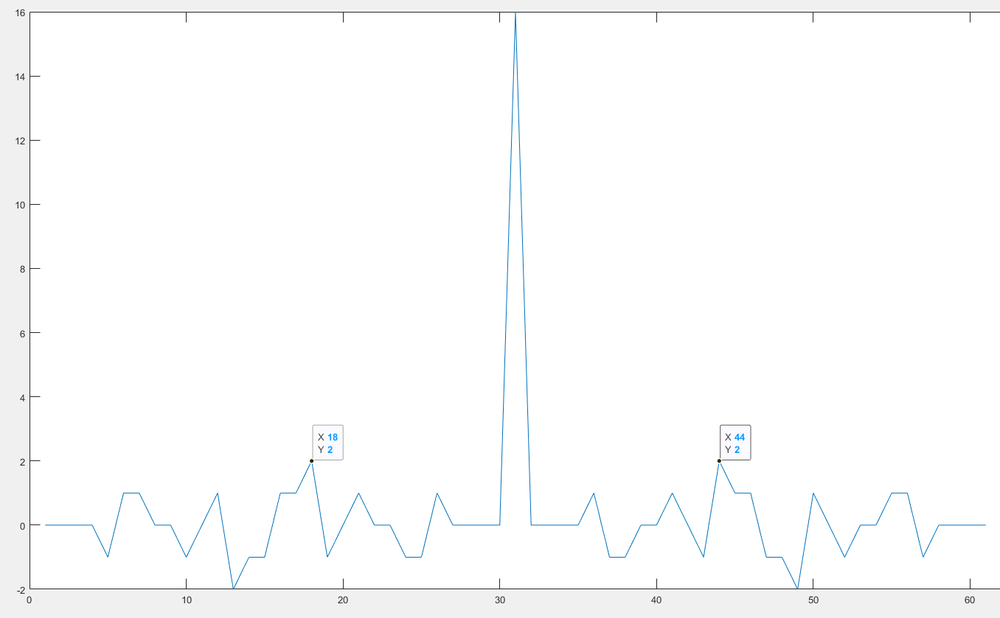

# 3. 关于IEEE 802.15.4相关标准

## 3.1 IEEE 802.15.4a标准

### 标准介绍
IEEE 802.15.4a标准于2007年发布，该标准中使用了UWB技术，主要为BPRF技术，有效平均PRF值有3.9 MHz、15.6 MHz或62.4 MHz，支持数据率110 kbps、850 kbps、6.8 Mbps。

使用Matlab提供的*Communication Toolbox Library for ZigBee and UWB*对UWB信号进行了仿真，如下为前导码长度为64、SFD长度为8、PHR长度为21bit、PHR数据段速率为850kbps，数据段长度为1016字节。

### HRP UWB PHY

突发位置调制（Burst Position Modulation, BPM）和二进制相移键控（Binary phase-shift keying, BPSK）的结合用于支持使用公共信令方案的相干和非相干接收机。组合的BPM-BPSK用于调制符号，其中每个符号由UWB脉冲的active burst组成。通过使用可变长度突发来支持各种数据速率。
关于创建和调制HRP UWB PPDU的处理框架如下图。

Reed-Solomon编码

对应的在接收端，将根据不同的类型进行处理

### 3.2 HRP UWB PPDU格式

#### 3.2.1 PPDU编码处理

#### 3.2.2 符号结构（Symbol structure）

#### 3.2.3 PSDU时序参数

#### 3.2.4 前导码时序参数

#### 3.2.5 SHR段
在标准中定义了4个强制前导码：默认前导码、短前导码、中前导码、长前导码。前导码的长度在数据传输中需要配置。 
SHR段的构成如下图：

##### 3.2.5.1 SYNC段
HRP UWB PHY支持两种长度的前导码：长度为31的码和可选长度127的编码。每个前导码是从三进制{-1 0 1}中提取的代码符号序列，且由于其完美周期自相关特性而被选择用于HRP UWB PHY。

以前导码9为例，其自相关波形如下图：

以前导码5为例，其自相关波形如下图：

从自相关波形来看，两种长度的前导码都有较好的自相关特性，旁瓣都非常小，非常适合用于信道的估计。

##### 3.2.5.2 SFD段
短SFD用于默认和中等数据速率，而长SFD用于110 kbps的可选低数据速率。
短SFD应通过前导码符号$S_i$扩展[0 +1 0 -1 +1 0 0 -1]获得，其中最左边的比特应最先传输。长SFD序列同样需要通过前导码符号$S_i$扩展[0 +1 0 –1 +1 0 0 –1 0 +1 0 –1 +1 0 0 –1 –1 0 0 +1 0 –1 0 +1 0 +1 0 0 0 –1 0 –1 0 –1 0 0 +1 0 –1 –1 0 –1 +1 0 0 0 0 +1 +1 0 0 –1 –1 –1 +1 –1 +1 +1 0 0 0 0 +1 +1]获得。

#### 3.2.6 PHR段

#### 3.2.7 PHY有效载荷段
PHY有效载荷字段编码如下图：

对称RS中(K+8, K);
对称卷积编码R=1/2，输出$g_0^n$、$g_1^n$。

## 3.2 IEEE 802.15.4z标准
2018年1月，为了响应更高的操作要求，802.15.4z工作组成立，以定义HRP和LRP的PHY与MAC层。IEEE 802.15.4z专注于附加的编码和前导码选项，以及对现有调制的改进以提高测距的完整性和准确性。

IEEE 802.15.4z标准于2020年修订，对UWB技术进行了一定的修订，在PHY层做出了一些改动，支持两种PRF模式：BPRF、HPRF。
 - BPRF（base pulse repetition frequency），平均PRF为62.4 MHz，支持数据率为6.81 Mbps。
 - HPRF（Higher pulse repetition frequency）,平均PRF为124.8 MHz或249.6MHz。

 
另外，在IEEE 802.15.4z中另外引入的一个关键特性为加扰时间戳序列（Scrambled Timestamp Sequence, STS），增强了数据的完整性（integrity），进一步提高了UWB技术在应用的安全性。通过STS安全机制，可以防止恶意设备通过注入信号能量进行不同形式的攻击，进而使测距接收端误读相关测距节点之间的距离信息，导致距离信息错误。

对于BPRF和HPRF模式，STS字段都是可选的。

另外，STS引入之后，数据帧变更为4种模式，即SP0、SP1、SP2、SP3。
TODO：关于几种STS的位置

在实现上，可以根据具体应用的需求来控制STS段的数量，具体不同段的作用？需要查明

 
如下为HPRF模式下，平均PRF为124.8 MHz、1个STS段，STS长度为64，前导码编码为27，前导码长度为64。

**参考文献**：

1、UWB仿真库，matlab, [matlab-uwb](https://ww2.mathworks.cn/help/comm/uwb.html)

2、IEEE 802.15.4-2015.

3、IEEE 802.15.4z IEEE Standard for Low-Rate Wireless Networks.