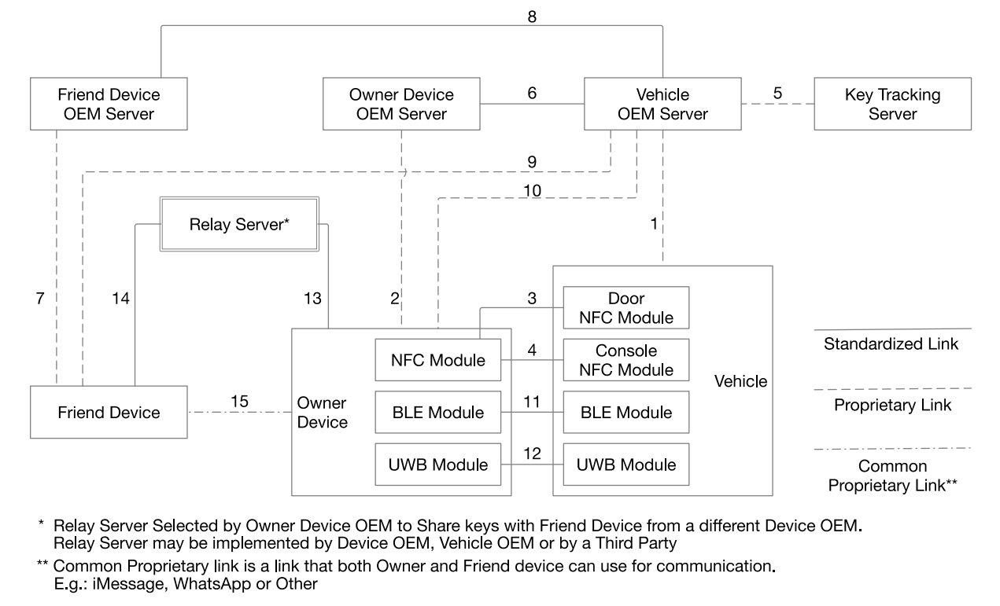

# 2. 关于CCC联盟

&emsp;&emsp;[Car Connectivity Consortium](https://carconnectivity.org/)，车联网联盟，简称为CCC，是一个致力于智能手机到汽车连接行业标准及解决方案的全球跨行业组织。

&emsp;&emsp;该联盟成立于2011年，由全球汽车制造商、移动设备制造商、技术供应商以及汽车零部件供应商等企业组成。其目标是将汽车和消费技术聚集在一起，使智能设备实现未来车辆的接入。该联盟的核心基础为CCC数字钥匙（CCC Digital Key），其在2021年7月发布了支持UWB技术的第三代数字钥匙核心技术规范。

 - 愿景：创建可持续和灵活的生态系统，使车辆和智能手机之间的接口标准化。CCC旨在通过提高互操作性以便能够在所有车辆和移动终端上提供一致的用户体验。

 - 使命：代表全球大多数汽车和智能手机行业，将相关行业聚集在一起，为未来的汽车到智能手机连接制定行业标准和解决方案。CCC在汽车信息、通信和/或娱乐系统的集成操作中促进了移动设备、服务和应用程序的连接。移动设备OEMs和车辆OEMs的协调，以构建更易使用、便利、安全和隐私保护以及广泛功能的产品。

&emsp;&emsp;联盟创始会员有：Apple、小米、宝马、DENSO、福特汽车、GM、Google、HONDA、现代汽车、奔驰汽车、NXP、Panasonic、三星、大众、THALES。

&emsp;&emsp;Digital Key是一种数字车钥匙技术，它允许车主使用智能手机等移动设备来远程控制车辆，包括开启车门、启动发动机等功能。CCC R3是基于NFC/BLE/UWB作为基础的无线电技术的使用，该系统采用非对称密码技术对车辆和设备进行相互签名认证，且只对已知车辆显示身份，只有使用和车辆存储的公钥相对应的私钥签名计算，车辆才能进行解闭锁、启动发动机等功能。R3可以兼容R2（第二代数字钥匙），R1（第一代数字钥匙）是独立于R2、R3进行部署。

&emsp;&emsp;关于CCC协议而言，主要针对第三代的数字车钥匙应用，其中包括了车钥匙服务器、跟踪服务器、车端、钥匙端等等，具体在钥匙端、车端的物理感知层又包括了NFC、BLE、UWB、Security Element单元等多项技术，在本文中，重点仅介绍UWB相关的协议内容。

## 2.1 CCC数字钥匙方案

&emsp;&emsp;2021年7月CCC将UWB定义为第三代数字钥匙的核心技术，并发布CCC R3（第三代数字钥匙）规范。

&emsp;&emsp;CCC DK R3是基于NFC/BLE/UWB无线电为基础的数字钥匙应用，该系统采用**非对称密码技术**对车辆和设备进行相互签名认证，且只对已知车辆显示身份，只有使用和车辆存储的公钥相对应的私钥签名计算，车辆才能进行解闭锁、启动发动机等功能。DK R3可以兼容R2（第二代数字钥匙），R1（第一代数字钥匙）是独立于R2、R3进行部署。

&emsp;&emsp;在成功完成车主配对后，车主每次携带移动设备靠近车辆前，应执行安全测距流程（UWB技术），先建立安全测距，然后才能启动相关接近功能，如迎宾、Lock、Unlock功能；一旦建立了安全测距和设备本地化，车辆可以根据其策略或要求决定启动上述行动。在建立安全测距之前需要URSK（UWB Ranging Security Key, 测距密钥），车辆可以有一个预先派生的URSK或根据需要派生一个新的URSK。URSK的机密性和完整性应在URSK的整个生命周期内得到保护。

### 2.1.1 DK体系架构
DK体系架构:

DK体系框架中各个流程的说明如下：
1. 车辆通过线路1远程连接到车辆云端，此链路提供安全的通信通道，并由车辆云端安全控制； 
2. 车辆配备了NFC（线路3/4）、BLE（线路11）、UWB（线路12）模块，可与设备通信以进行车主配对； 在CCC R3的技术规范中，创新性的引入了UWB技术，利于最新UWB技术的安全性（有效防止中继攻击、重放攻击）以及高精度定位能力，为新一代数字钥匙赋能。
3. 所有合格的设备都有一个经过认证的SE以及NFC功能，使设备与车辆能够进行通讯，其中NFC功能是必须的，保证手机在没电的情况下依旧可以靠NFC对车辆的一些操作； 
4. 车主设备通过线路2、线路6、线路8、线路7与车主设备云端、好友设备云端、好友设备进行通信分享钥匙给好友设备，对好友设备进行车主可设置的访问配置文件、终止分享的DK；好友设备可以使用车主分享的DK，但不能向其它设备分享车主的的钥匙； 
5. 车主设备通过线路2与车主设备云端通信，好友设备通过线路7与好友设备云端通信。车主设备/好友设备也可以通过线路10/线路9直接与车辆云端通信； 
6. 车主设备和好友设备可分别通过各自的设备云端线路2/线路6、线路7/线路8直接与车辆云端通信；线路6/线路8用于交换车辆和车主/好友设备云端的证书，实现钥匙分享、跟踪、终止、通知、认证的功能； 
7. 设备云端负责管理DK的生命周期（数据的周期），并分别通过线路2/线路7更新、删除、暂停、恢复车主/好友设备中的证书；它可在设备丢失不可用时让其钥匙功能失效或恢复功能正常； 
8. 车辆云端负责管理用户账户和ID&V（识别和验证用户身份）；它还通过线路5连接到KTS，以注册车辆所有的已颁发的DK，从而保留存储信息的隐私。

在CCC Digital Key 3.0的规范中，引入了UWB技术，利用其安全测距的特性，进一步提高了数字钥匙的安全性能。

## 参考文献

[1] Car Connectivity Consortium Digital Key Release 3 Technical Specification Version 1.1.2
