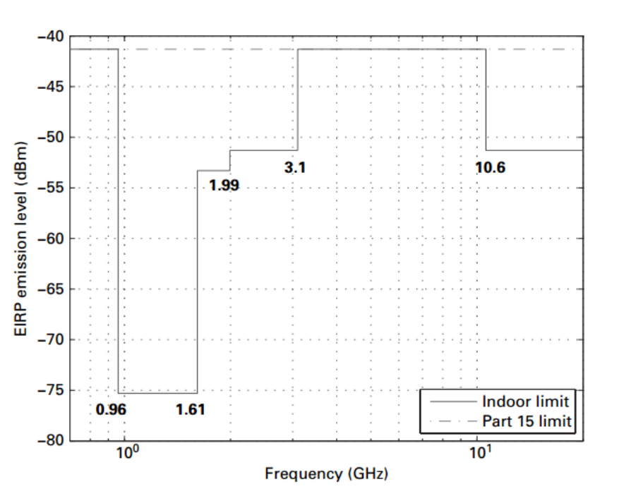

# 1. 关于UWB
## 1.1 UWB技术的发展历史
&emsp;&emsp;超宽带技术（Ultra Wideband，简称UWB），是一种无线通信技术，与传统的窄带通信技术相比，UWB技术的带宽非常宽，相应数据传输速率高，且具有良好的抗干扰和穿透能力。 
&emsp;&emsp;UWB技术最初是由美国国防部研究局（DARPA）于20世纪60年代开发，主要用于雷达系统和军事通信领域。UWB技术的特点是信号带宽极宽，信号的时域和频域特性非常复杂，可以通过这种信号实现高分辨率的目标探测和跟踪。 
&emsp;&emsp;在1990年代，UWB技术开始进入商用领域，主要用于雷达成像、无线通信和测距等应用。
&emsp;&emsp;2002年，美国联邦通信委员会（Federal Communications Commission, FCC）发布了UWB技术的规定，允许在特定频段内使用UWB技术进行短距离通信和定位应用。根据FCC的定义，中心频率$f_c$大于2.5GHz的UWB系统必须具有大于500MHz的带宽。超宽带凭借其传输速率高、成本低、低功耗、抗干扰能力强等优点，日益受到关注。现已在工业、医疗、汽车、物联网等多个领域得到了广泛的应用。 
&emsp;&emsp;2019年，UWB技术开始被苹果公司应用于其新款iPhone手机中，实现AirDrop空间感知功能，这标志着UWB技术进入了智能手机等大众消费电子市场。随后陆续在Apple Watch，AirTag设备中都引入了UWB技术，将UWB技术带入了大众的视野。
此外，三星、小米等手机厂商都在其产品中引入了UWB技术，以实现设备之间更精准的定位以及共享，实现与其他智能设备之间的无缝连接。 
&emsp;&emsp;未来，随着技术的不断进步和应用场景的不断拓展，UWB技术将在更多领域发挥重要作用。

## 1.2 UWB信号的国际规定
基于UWB信号具有独特的特性，对通信、测距和雷达应用都非常有用。然而，由于UWB信号在频谱中占据了很大一部分，因此它们需要与现有系统共存而不造成明显干扰。如果允许UWB信号在这些系统的频率范围内不受任何限制地传输，常见的一些系统都可能会被UWB信号的发射所干扰。因此，UWB发射机必须满足某些要求，以免对其他系统的功能造成任何不利影响。

基于此原因，在国际上对于UWB的应用也推出了相关的规定，进而能够保证UWB系统的日常生活中得到应用和普及。

### 1.2.1 FCC规定

FCC中规定，UWB系统必须在一定功率水平以下传输，以免对同一频谱中的其他系统造成严重干扰。具体而言，对于3.1 GHz至10.6 GHz的频率范围，功率谱密度不得超过-41.3 dBm/MHz，且在该频段以外必须更低（按单个信道500MHz计算，信道功率为-14.31dBm）.

此外，根据具体应用领域的不同，各种系统在某些频段中必须具有更低的限制。其中对于通信、车载雷达和成像系统这三个领域的限制如下[1]。

#### 通信系统

对于通信系统，室内和室外系统规定的 FCC 限值略有不同，如图所示。具体而言，室外系统在 1.61 至 3.1 GHz 频段的发射与室内系统相比应额外衰减 10 dB。
室内系统的UWB设备不允许在室外使用，或将其辐射指向室外。只允许点对点通信；即每个发送器只能发送到相关联的接收器。室内UWB系统具有许多潜在的应用，例如高速无线个域网(WPAN)和无线 USB (wUSB)。

对于室外系统，FCC 要求 UWB 设备在没有固定基础设施的情况下运行，并且仅与其关联的接收器通信。室外UWB通信的应用包括物体定位和跟踪，利用了UWB信号的精确测距能力。

#### 车载雷达系统

车载雷达系统可以在 22 和 29 GHz 之间在-41.3 dBm/MHz限制下运行。此外，此类系统的中心频率要求高于24.075 GHz，如果仰角大于地平线30°，则23.6-24 GHz频段需要额外衰减25 dB，这需要防止对在低地球轨道卫星上运行的无源传感系统的任何干扰。最后，车载雷达系统只能在车辆运行时运行；也就是说，只能在发动机运转时启动。

从当前实际的情况而言，对于车载雷达系统，更多已经切换到毫米波雷达系统，频率也更高，常见77 GHz/ 79 GHz，整体探测距离可以在几十米到几百米之间，能够在恶劣天气条件下进行精确探测，用于车辆自动驾驶系统中的障碍物检测、辅助驾驶等功能。

对于欧洲电信标准化协会（ETSI）和美国联邦通信委员会（FCC）对24GHz频率中UWB频段的限制，2022年1月1日以后，UWB频段将无法在欧洲和美国使用，只有窄带ISM频段可以长期使用。

在国内，目前工信部授权频段为76-77 GHz，在角雷达领域77-81 GHz也进行了授权。

#### 成像系统

在成像系统应用中，可以分为探地雷达 (GPR)、墙壁成像、医学成像、穿墙成像和监视系统。表 2.1 总结了这些系统的 FCC 发射限制。
FCC 要求必须协调各种成像系统（GPR、成像和医疗）的操作，并且必须报告操作的日期和位置。此外，使用表 2.1 中所述的成像系统需要许可，每个系统的使用仅限于某些组织。例如，监视系统只能由公共安全、制造、石油和电力许可证持有者操作。尽管 FCC 的发射限制因各种类型的 UWB 系统而异，但还有许多其他 FCC 法规对所有 UWB 系统都是通用的。

 - 发射最高功率的频率 $f_M$ 必须在−10 dB 绝对信号带宽内。
 - $f_M$ 附近50 MHz 带宽内的峰值发射不得超过0 dBm EIRP。
 - 0.96 GHz 以下的发射受FCC的−41.3 dBm/MHz 限制。
 - 不允许在飞机、轮船或卫星上操作。

### 1.2.2 其他监管

UWB 于2002年在美国获得 FCC 授权后，欧洲和亚洲的监管工作一直在进行，以在某些限制下批准使用 UWB 设备。对于兼容性问题，在全球范围内制定相同的法规将是有益的。但是，发射功率限值在世界不同地区存在一些差异。因此，UWB 设备应具有足够的灵活性以在全球范围内运行，或者根据最坏情况进行设计。

以下为欧洲和日本的监管情况。日本和欧洲都允许使用 UWB 系统，尽管预计在不久的将来会对最初的规定进行修改。

#### 欧洲
在欧洲，欧洲邮政和电信管理委员会（CEPT）的电子通信委员会（ECC）对UWB法规进行了技术研究。 ECC的研究和建议得到了欧盟委员会 (EC) 无线电频谱委员会 (RSC) 的考虑，该委员会最终决定（在 2007 年初）在成员国中有效的 UWB 法规。
UWB 系统可以在 6–8.5 GHz 频段上以 −41.3 dBm/MHz 的速度传输。该限制在 2010 年底前也适用于 4.2–4.8 GHz 频段。从 2011 年开始，该频段的 EIRP 将被限制在 −70 dBm/MHz。请注意，美国的 FCC 在 3.1–10.6 GHz 的更宽频带上允许 EIRP 为 −41.3 dBm/MHz，限制更加严格。

UWB系统在欧洲需要符合特定的通信标准，例如ETSI EN 302 065和ETSI EN 302 065-2等。

在欧洲销售和使用UWB设备需要进行认证，以确保设备符合欧洲规定的技术标准和要求，认证机构包括欧洲电信标准化协会（ETSI）等。

#### 日本
在日本，总务省 (MIC) 于 2006 年 3 月批准了室内 UWB 设备的规定。然而，这些初始规定将来可能会被修改和扩展。具体而言，其正在研究在室外和汽车内部使用的UWB设备。

日本目前的法规规定了两个可用频段 3.4–4.8 GHz 和 7.25–10.25 GHz 用于 UWB 操作，其中可以发射 −41.3 dBm EIRP（在 1 MHz 上测量）。对于第一个频段，需要采用干扰抑制技术，否则平均功率必须降至 −70 dBm。此外，两个频段在50 MHz上测得的峰值功率不得超过 0 dBm EIRP。

对于在日本销售和使用UWB设备需要进行认证，以确保设备符合日本规定的基数标准和要求。认证机构包括日本电波协会（ARIB）和电波法认证机构（MIC）等。

## 1.3 UWB与其他技术对比
### 1.3.1 UWB与蓝牙
UWB和BLE具有许多共同的特点：低功耗、低成本、用于资产跟踪等。然后，UWB可以提供比蓝牙技术更高的精度。主要由于UWB通过飞行时间估计距离的方法来确定位置，且由于UWB的高带宽，可以得到极高的时间分辨率，进而可以得到较高的定位精度。
而BLE定位技术通常则使用RSSI来实现定位（对于最新的BLE 5.1标准中也增加了蓝牙AoA等方案，精度有所提高），此种方法在距离较远的情况下，估计精度不高。另外，BLE的覆盖范围以及数据速率均比UWB低，且更容易受到信号干扰。
但是蓝牙作为一个相对更加成熟的技术，已经形成非常成熟的生态环境，覆盖的应用场景非常广，因此在一段时间内都将是一个非常重要的技术基础。以最新的CCC的数字钥匙3.0方案来说，通常情况下，也会使用BLE作为OOB的主要方式。

### 1.3.2 UWB与WiFi

WiFi目前在室内空间作为室内短距离无线通信的重要手段而被广泛使用，已然成为室内的一项关键技术，同样，在室内定位方面来说，也是非常关键的射频技术。当然，从定位精度的角度来说，WiFi的精度低于UWB，更多的依然使用RSSI的方式来估计距离，与蓝牙相似。同样，WiFi也更容易受到信号干扰，而UWB对信号干扰，以及多径干扰等有着天然的优势。
但WiFi作为广泛使用的室内数据通信接入点（AP），对于不需要高精度的场景而言，其有着天然的覆盖优势。
从目前的一些应用来说，通过不断的收集固定场景中可能存在的WiFi设备的RSSI信号强度，形成对应场景下的空间指纹谱，对于用户而言，只需要根据收集的WiFi设备的情况与空间指纹谱进行对比，即可实现室内的较为精确的定位。

| 维度  |     UWB     | 蓝牙5.1 AoA | WiFi定位 | ZigBee定位 |
|------|:----------:|:----------:|:--------:|:---------:|
| 定位原理 |   ToF/TDOA   |  AOA测量   |   RSSI   | RSSI/相位差 |
| 定位精度/米 |   0.1-0.3   |  0.3-0.5   |   3-5    |    3-10   |
| 优势   | 传输速率高、发射功率较低、定位精度高 | 设备体积小、设备终端多、定位精度较高 | 便于扩展、成本低 | 低功耗、低成本 |
| 劣势   | 功耗大、成本高、覆盖范围小 | 稳定性较差、受噪声信号干扰大 | 定位精度低 | 容易受环境干扰 |

## 1.4 UWB发展历史

> 本节简要介绍UWB的发展历史，从其应用形成、相关标准的发展等进行简单的介绍。

UWB的通信方式分为脉冲无线电（impulse radio, IR）和载波调制方式。脉冲无线电是传统的UWB实现方式，载波调制方式是FCC规定了UWB通信的频谱范围和功率限制之后提出的，其中调制载波方式又可以分为单载波的直接序列扩频超宽带（Direct sequence UWB, DS-UWB）和多载波正交频分多路复用（Multi-Band OFDM Alliance, MBOA）体制。

从2002年开始IEEE开始制定802.15.3a标准，出现了两大技术阵营，基于多频带正交频分复用技术的超宽带方案（MB-OFDM-UWB）和基于脉冲无线电技术的直接序列超宽带方案DS-UWB。两种方案区别很大，无法相互兼容，因此在802.15.3a无法统一两种方案，在2006年，工作组解散。

主导MB-OFDM-UWB的WiMedia联盟在2007年3月将基于该方案的标准提交到ISO，并得到认证，成为超宽带技术的第一个国际标准。

IEEE 802.15.4a工作组于2004年3月成立，该方案采用两种可选择的物理层，由超宽带脉冲无线电（Impulse Radio UWB, IR-UWB）和Chirp扩频（Chirp Spread Spectrum, CSS）组成，最终在2007年3月，IEEE802.15.4a被IEEE-SA标准委员会批准为IEEE 802.15.4-2006，在2011年和2015年该标准又得到补充修订，分别命名为IEEE 802.15.4-2011和IEEE 802.15.4-2015。

### 1.4.1 国外技术发展趋势
&emsp;&emsp;Timedomain、Decawave，相继已经被4D robots、Qorvo收购。
另外，还有Zebra等企业，涉及到IEEE 802.15.4f协议。

### 1.4.2 国内发展趋势
此外，在中国国内也有相关的企业开始进行UWB芯片的国产化研究，如纽瑞芯、优智联等等企业。

## 参考文献

[1] Arslan Huseyin, Chen Zhi Ning, Benedetto Maria-Gabriella Di. Ultra Wideband Wireless Communication.

[2] Ross G F. The Transient Analysis of Certain TEM Mode Four-Port Networks.

[3] Barrett T W. History of Ultra WideBand (UWB) Radar & Communications: Pioneers and Innovators.

[4] Ghavami M, Michael L B, Kohno R. Ultra Wideband Signals and Systems in Communication Engineering.

[5] US 47 CFR Part15 Ultra-Wideband Operations FCC Report and Order. Available: http://www.fcc.gov/Bureaus/Engineering_Technology/Orders/2002/fcc02048.pdf

[6] 刘琪，闫丽，周正. UWB的技术特点及其发展方向。

[7] IEEE Standard for Low-Rate Wireless Networks, IEEE Std 802.15.4-2015.

[8] Ultra-Wideband Positioning Systems.

