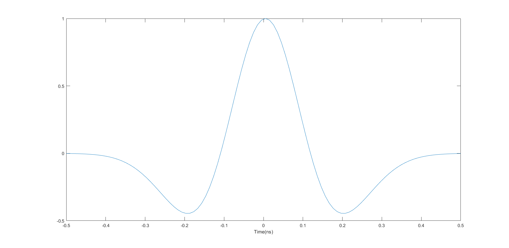
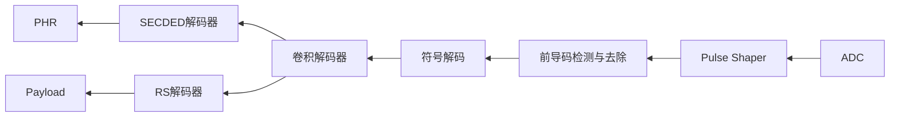
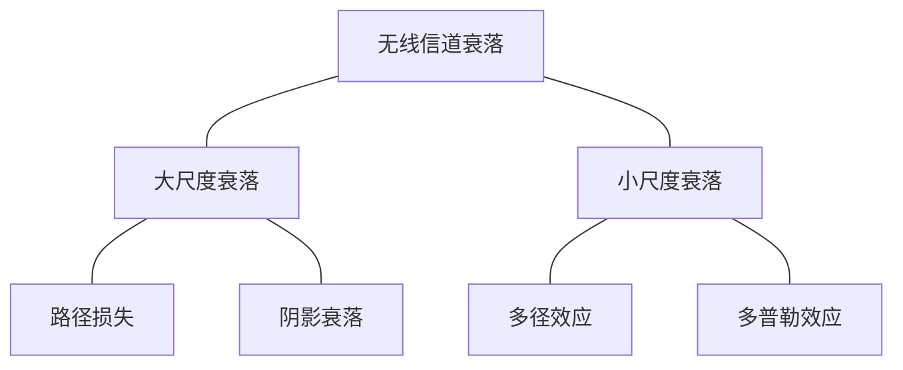

# UWB基础原理

## UWB信号

&emsp;&emsp;通常，UWB信号被定义为具有大于20%相对带宽或至少500MHz绝对带宽的信号。 
&emsp;&emsp;关于超宽带的两种定义如下（美国FCC规定）：
 - 对于中心频率大于2.5GHz，绝对带宽需要大于500MHz。
 - 对于中心频率小于2.5GHz，频宽比（fractional bandwidth）大于0.2。 
 $$ B_{frac} = \frac{2(f_H-f_L)}{f_H+f_L} > 0.2$$
 &emsp;&emsp;UWB信号的主要特征是其比传统信号占据更宽的频带。相应的其持续时间非常短，通常为ns量级。

### 高斯脉冲

$$ \omega(t)=A(1-\frac{4\pi t^2}{\zeta^2})e^{-2\pi t^2/\zeta^2} $$

$\zeta$ 为脉冲主瓣宽度，周期为N。

图中所示脉冲宽度为1ns，主瓣宽度为0.4ns。

## UWB信号的国际规范

## UWB信道模型

### 宽带与窄带对比

### UWB信道特性

发射机PHR发射部分流程：

&emsp;&emsp;SECDED是一种前向纠错编码，全称为Single Error Correction, Double Error Detection，即单错误纠正双错误检测码。它可以检测和纠正一个位错误，同时可以检测但无法纠正两个位错误。SECDED编码在每个数据块中添加一个冗余位，称为校验位或奇偶校验位，以便检测和纠正错误。SECDED编码的冗余位通过对数据块中的所有位进行异或运算得到，因此当数据块中的某个位发生了改变，都将导致校验位发生改变。
接收方在接收时，对接收到的数据块进行校验，如果校验结果不正确，则说明数据块中存在错误。如果校验结果指示只有一个错误，则可以使用校验位来确定错误的位置，并对其进行纠正。如果校验结果指示存在两个或更多错误，则说明数据块错误不可纠正，不再可用。

而对于数据载荷部分，则使用RS编码而非SECDED编码：

Reed-Solomon编码

对应的在接收端，将根据不同的类型进行处理

## UWB技术发展现状
&emsp;&emsp;经过一段时间的发展，涌现了一批从基础电路开始的一些企业，降低了UWB技术使用与推广的门槛，典型的芯片有Qorvo公司推出的DW1000系列芯片，NXP推出的NCJ29D5、SR040/SR150等相关UWB芯片。在中国国内也涌现了如纽瑞芯、优智联等一些企业在积极推动底层芯片技术的普及。

&emsp;&emsp;在应用普及方面，以四相科技、清研讯科等相关企业为代表，将UWB技术应用到包括煤矿、化工、智能制造等多个工业领域的企业，积极推动UWB技术的普及以及应用。

&emsp;&emsp;随着汽车行业的发展，UWB技术也作为第三代的汽车数字钥匙的首选技术方案，其中宝马汽车已经在其最新的车型中使用该技术，国内的蔚来汽车ET5、ET7，Zeeker 009等车型也都引入了UWB技术。

## 3.2 UWB信道特性
&emsp;&emsp;有两种常用的方法来表征UWB信道。在第一种方法中，考虑具有已知电磁特性的材料的环境，并假设环境的完整几何信息是可用的。然后，可以使用带有射线追踪技术的电磁模拟工具生成环境的传播特性。这种方法被称为确定性建模。尽管它的优点是提供了传播环境的良好表示，但影响建模的一个主要缺点就是需要在特定的环境。此外，收集准确的地点信息可能相当麻烦。如果场地环境发生变化，则相应的模型可能也随之改变。
&emsp;&emsp;另一种更为常见的信道建模的方法是从实际信道测量中导出统计模型。这种方法也被称为**统计建模方法**，其没有确定性建模复杂。需要精确建模的关键信道参数是路径损失、阴影衰落（shadowing），功率延迟分布、小尺度衰落。

### 路径损耗

