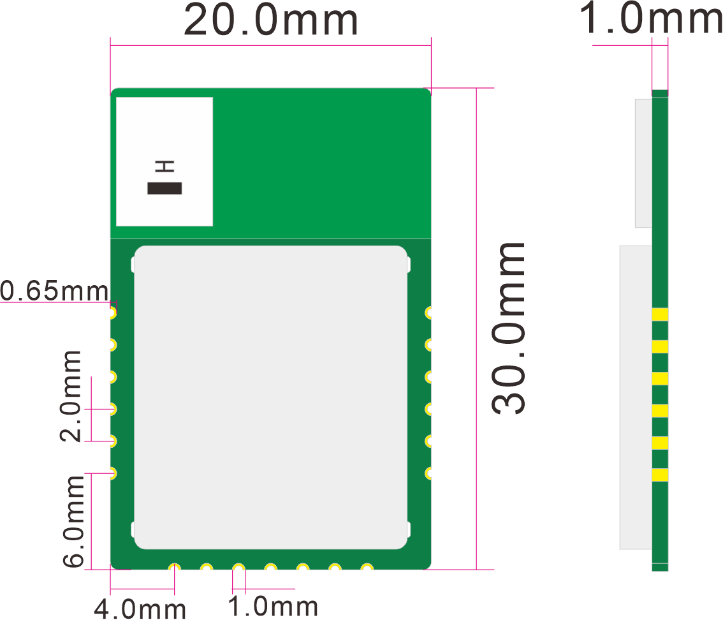
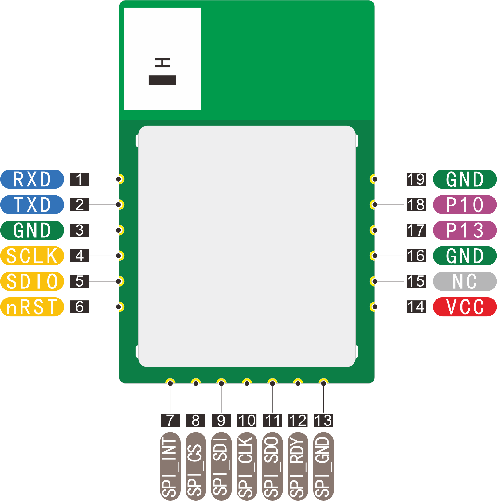
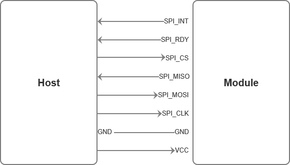
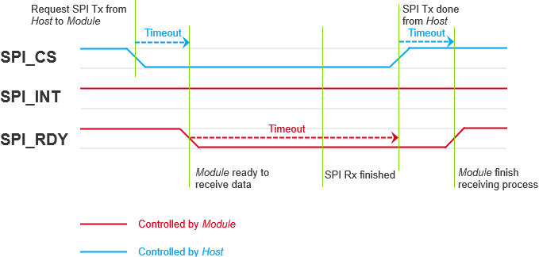
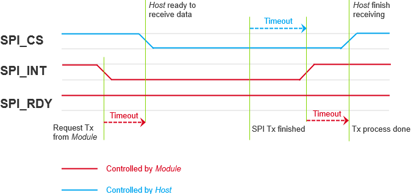
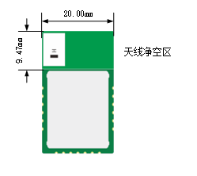
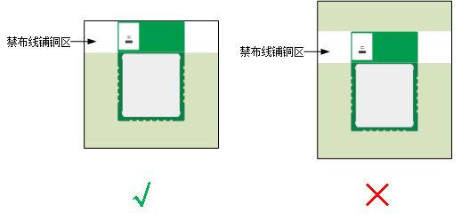
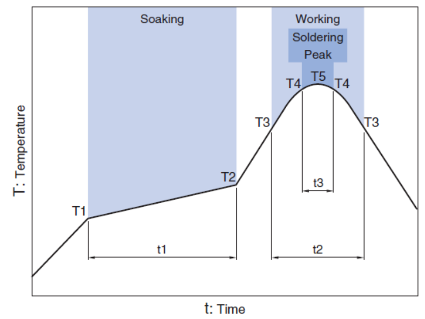
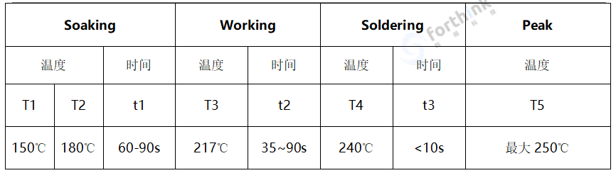

DK-M01数据手册
================

总览
----

描述
~~~~~
EH100607M02-M1是一款基于NXP的NCJ29D5的小型UWB收发模块，模块对外提供串口通信接口、6线SPI接口和2个GPIO，可以通过半孔形式贴装于用户PCB上，尺寸为20*30*1mm。
UWB PHY符合IEEE 802.15.4™-2015标准并向下兼容，嵌入式PHY和MAC兼容FiRa/CCC联盟规范，可以用于无线通信与测距、TOF定位等。

特性
~~~~~

.. figure:: images/DK_M01_Appearance.png
    :alt: 外观示意图
    :figwidth: 400px
    :figclass: align-center

    外观示意图

* 可用于智慧工业、智慧物流、智能家居等IoT应用场景
* 尺寸精巧：20mm*30mm*1mm
* 提供19引脚邮票孔接口，方便用于PCB SMT装配
* 支持多种I/O端口：UART/SPI/GPIO
* 供电电压：2.0 V ~ 3.5 V
* 支持频段：6.0GHz-8.5GHz
* CPU核：ARM® Cortex-M33 32-bit 处理器
* 输出功率：最大发射功率-23dbm/MHz

规格
----

尺寸
~~~~~

    尺寸说明图

引脚说明
~~~~~

    引脚说明图

+------------+------------+--------------+----------------+
| 引脚标号    | 引脚名称    | 输入/输出    | 引脚功能描述    |
+============+============+==============+================+
| 1          | RXD        | 输入         | 串口通信输入     |
+------------+------------+--------------+----------------+
| 2          | TXD        | 输出         | 串口通信输出     |
+------------+------------+--------------+----------------+
| 3          | GND        | 输入         | 模块接地引脚     |
+------------+------------+--------------+----------------+
| 4          | SCLK       | 输入         | 串行调试接口时钟输入 |
+------------+------------+--------------+----------------+
| 5          | SDIO       | 输入/输出    | 串行调试接口数据输入输出 |
+------------+------------+--------------+----------------+
| 6          | nRST       | 输入         | 模块复位输入，低有效 |
+------------+------------+--------------+----------------+
| 7          | SPI_INT    | 输出         | SPI的INT引脚，用于指示NTF或RSP等数据准备就绪，低有效 |
+------------+------------+--------------+----------------+
| 8          | SPI_CS     | 输入         | SPI的片选引脚，低有效 |
+------------+------------+--------------+----------------+
| 9          | SPI_SDI    | 输入         | SPI数据输入     |
+------------+------------+--------------+----------------+
| 10         | SPI_CLK    | 输入         | SPI时钟         |
+------------+------------+--------------+----------------+
| 11         | SPI_SDO    | 输出         | SPI数据输出     |
+------------+------------+--------------+----------------+
| 12         | SPI_RDY    | 输出         | SPI的Ready引脚，用于指示模块准备从主机获取CMD，低有效 |
+------------+------------+--------------+----------------+
| 13         | GND        | 输入         | 模块接地引脚     |
+------------+------------+--------------+----------------+
| 14         | Vcc        | 输入         | 模块电源输入，适用3.3V |
+------------+------------+--------------+----------------+
| 15         | NC         | ——           | 未连接引脚，接地或悬空 |
+------------+------------+--------------+----------------+
| 16         | GND        | 输入         | 模块接地引脚     |
+------------+------------+--------------+----------------+
| 17         | P13        | 输入/输出    | GPIO           |
+------------+------------+--------------+----------------+
| 18         | P10        | 输入/输出    | GPIO           |
+------------+------------+--------------+----------------+
| 19         | GND        | 输入         | 模块接地引脚     |
+------------+------------+--------------+----------------+

规格参数
~~~~~

+---------------------------------------------------------+
| **DK-M01模块规格参数**                                    |
+=========================================================+
| 产品系列        | EH100607                              |
+---------------------------------------------------------+
| 型号＆配置      | M02-M1                                |
+---------------------------------------------------------+
| 模块尺寸        | 20.0x30.0x1.0mm                       |
+---------------------------------------------------------+
| 工作温度        | -20℃~60℃                              |
+---------------------------------------------------------+
| 贮存温度        | -40℃~85℃                              |
+---------------------------------------------------------+
| 工作电压        | 2-3.5V                                |
+---------------------------------------------------------+
| 工作电流        | ≤200mA                                |
+---------------------------------------------------------+
| CPU核心         | ARM® Cortex-M33 32-bit 处理器           |
+---------------------------------------------------------+
| 在线升级        | 支持                                  |
+---------------------------------------------------------+
| 固件包加密      | 支持                                  |
+---------------------------------------------------------+
| **射频参数（UWB）**                                        |
+=========================================================+
| 无线制式        | IEEE Std 802.15.4™-2015，向下兼容       |
+---------------------------------------------------------+
| 支持频段        | 5/9(6.0G~8.5G)                        |
+---------------------------------------------------------+
| 支持测距/定位方法 | TOF                                  |
+---------------------------------------------------------+
| 支持协议        | FiRa、CCC                             |
+---------------------------------------------------------+
| 定位典型发射功率 | -41.3dbm/MHz                          |
+---------------------------------------------------------+
| 最大发射功率    | -23dbm/MHz                            |
+---------------------------------------------------------+
| 工程覆盖范围(无遮挡) | 100m                             |
+---------------------------------------------------------+
| 传输数据速率    | 6.8M/7.8Mbps                          |
+---------------------------------------------------------+
| 接收灵敏度      | ≤-95dbm（该参数指在PRF64M，前导码长度64，数据率6.8M的配置下）|
+---------------------------------------------------------+

接口
~~~~~

SWD烧录接口
~~~~~~~~~~~

需要使用JLINK烧录程序时，需要把以下4个引脚连接到JLINK上。
  * Vcc：接JLINK的VCC
  * SDIO：接JLINK的SWDIO
  * SCLK：接JLINK的SWCLK
  * GND：接JLINK的GND

UART接口
~~~~~~~~

如需使用UART口传输数据，需要把以下4个引脚连接到串口设备上。
  * Vcc：接串口设备的VCC
  * RXD：接串口设备的TXD
  * TXD：接串口设备的RXD
  * GND：接串口设备的GND

SPI接口
~~~~~~~~

DK-M01模块提供6线SPI接口，Host与模块间的连接拓扑如下：

    SPI连接拓扑图

Host向模组发送命令（CMD）
~~~~~~~~~~~~~~~~~~~~~~~

    Host向模组发送命令（CMD）的时序图

Host向模组发送命令（CMD）应遵循以下顺序：

1. 主机将SS设置为活动状态
  - 主机应检查期间是否有INT请求
  - 如果期间有INT请求，则主机应推迟发送命令，从模组接收通知 
2. 模组准备SPI外围设备以进行后续操作
3. 模组激活RDY以通知主机可以开始数据传输
4. 数据传输完成后主机停用SS
5. 模组等待SS停用
6. 模组结束接收并停用RDY

模组向host发送响应（RSP）和通知（NTF）
~~~~~~~~~~~~~~~~~~~~~~~~~~~~~~~~~~~

    模组向host发送响应（RSP）和通知（NTF）的时序图

模组向host发送响应（RSP）和通知（NTF）应遵循以下顺序：

1. 模组准备SPI并将INT推至激活状态
2. INT激活时主机被触发
3. 模组等待SS激活
4. 主机将SS设置为激活状态并执行SPI传输
  - 为了确定响应的长度，主机可以首先接收包括UCI标头和长度信息的前四个字节
  - 然后主机可以读取剩余的字节
  - 主机不得在两个SPI传输之间撤销SS
  - 或者，主机可以传输最大UCI数据包长度

5. 一旦SS线路激活，模组将数据作为SPI后续传输，并忽略传入数据
6. 当数据传输完成时，INT线路被停用

主机应等待INT线路停用，然后再释放SS线路，以避免竞争条件

模块布局说明
~~~~~

天线净空区域
~~~~~~~~~~~~
模块布局需要关注天线的净空区域，如图所示的上半部分区域即为天线净空区。同时，天线是线极化，其极化方向与模块长边平行。

    天线净空区域示意图

PCB布局建议
~~~~~~~~~~

    PCB布局建议图

焊接说明
~~~~~

手工焊接
~~~~~~~~
焊接温度：360℃±5℃，最大5秒。

推荐回流焊接条件-无铅
~~~~~~~~~~~~~~~~~~~~
* 以0.8-1.7℃/s 上升至135-160℃。
* 以60-90秒缓慢升温至180-190℃。
* 以1-2℃/s上升至峰值温度235-250℃，217℃以上时间 35-90秒。
* 以1.5-2℃/s降温。

    回流焊接曲线图

注：焊接温度曲线也可以按照所使用锡膏推荐的温度曲线焊接。
