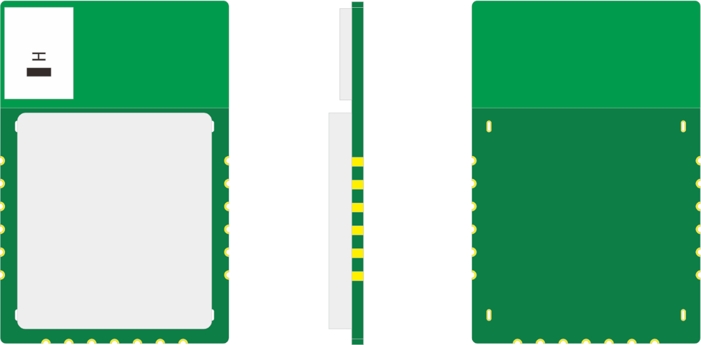

=================
DK-M01 UWB收发模块
=================

感谢您选择了DK-M01 UWB收发模块，以下是帮助您使用本产品的文档。

.. toctree::
    :maxdepth: 2

    Quick_Start.rst
    Datasheet.rst

产品概述

DK-M01（EH100607M02-M1）是一款基于NXP的NCJ29D5的小型UWB收发模块，模块对外提供串口通信接口、6线SPI接口和2个GPIO，可以通过半孔形式贴装于用户PCB上，尺寸为20*30*1mm。
UWB PHY符合IEEE 802.15.4™-2015标准并向下兼容，嵌入式PHY和MAC兼容FiRa/CCC联盟规范，可以用于无线通信与测距、TOF定位等。

产品特性

* 可用于智慧工业、智慧物流、智能家居等IoT应用场景
* 尺寸精巧：20mm*30mm*1mm
* 提供19引脚邮票孔接口，方便用于PCB SMT装配
* 支持多种I/O端口：UART/SPI/GPIO
* 供电电压：2.0 V ~ 3.5 V
* 支持频段：6.0GHz-8.5GHz
* CPU核：ARM® Cortex-M33 32-bit 处理器
* 输出功率：最大发射功率-23dbm/MHz
